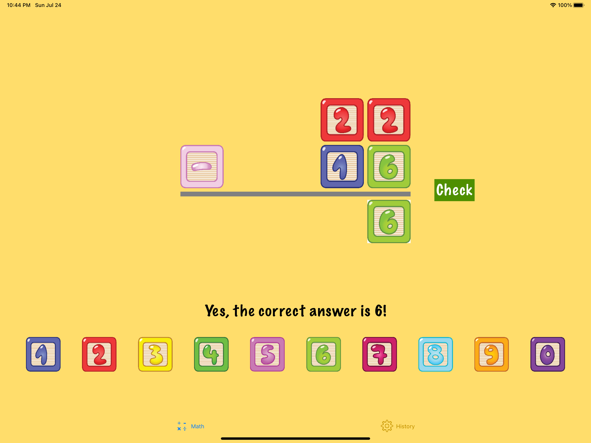
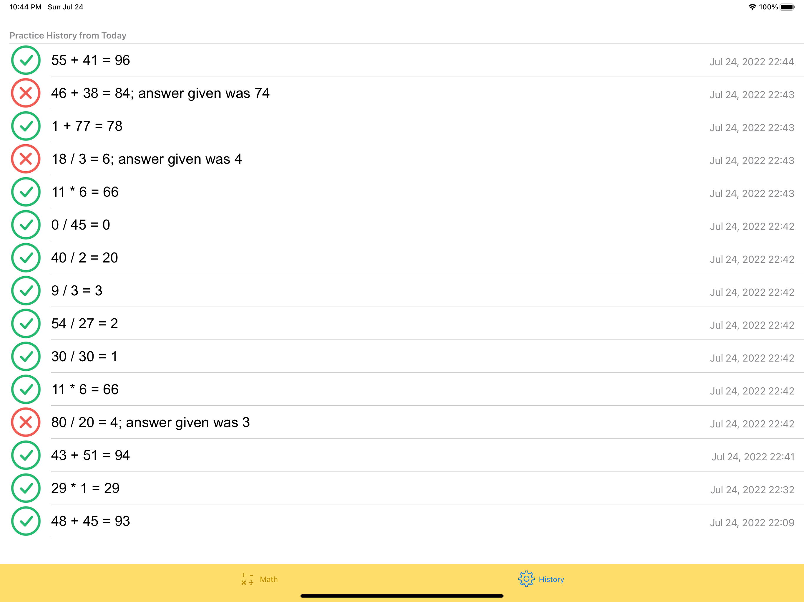

# LearningFun

A simple, no-frills app to help your young kids improve their basic arithmetic skills of addition, subtraction, multiplication, and division. This app is designed to be easy to use for kids and to allow them to practice simple arithmetic repeatedly many times within short periods of time. The app maintains a record of all practice problems presented to the user, and whether a correct answer was given for each.

## LearningFun App Overview

The app only has two (2) screens. The first screen is for the user to practice arithmetics.

 

The second screen display a history of the problems practiced and their results.

 

## How It Started

Many, many years ago, my wife asked me to find an app that our daughter who was then 6 years-old could use to practice basic addition, subtraction, and multiplication. After spending a couple weekends of search and not finding anything I thought was easy to use, I decided to embark on writing an app on my own, thinking that it would be fun and a good learning experience. Even though back in college and early in my career, I had written quite a few Macintosh applications, but that was before the OSX and iOS really came into their own.

After two  weekends of tinkering, the initial version of this app, and the first-ever app I had written up to that point, was born, and one item crossed off my wife's daily reminder :-)

Today, I would consider this app to have been developed in haste, and the implementation to be rather quick and dirty and based on quite limited knowledge of iOS development.

Despite those shortcomings, I still like the simple and user-friendly design it has. Most importantly, the joy I felt watching my 6-years-old daughter use this app and actually liking it will live with me forever.

## Contact me

Should you have any questions about this app, please feel free to contact me at

## License

Making the source code to this app available under

